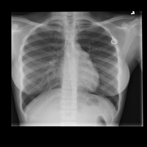

# MediScan by Team Anything.py

  
 

## 1. Overview
### 1.1 Context
Due to the work structure, there is a high burnout rate faced by junior doctors in Singapore's Healthcare Industry. According to Mr Koh Poh Koon, Senior Minister of State for Health, 20% of the junior doctors work more than 80 hours a week, which is above the Singapore Medical Council guidelines. The remaining 80% of the junior doctors work for 65 to 70 hours a week. To put that into context, based on Ministry of Manpower (MOM), the normal work arrangement is 44 hours a week. 

For junior doctors, they are normally in charge of 6 to 10 patients during a shift. However, they are on call, which means that these can go up to three wards, or even 100 patients. This results in a significant workload, and subsequently long working hours experienced by the junior doctors. Insufficient rest from long working hours together with demands from patients and relatives and the fear of making mistakes due to their inexperience, it will result in a recipe for disaster. Such factors will also contribute huge stress to junior doctors, potentially affecting their mental health and well-being in the long run.

### 1.2 Problem Statement
Junior doctors in Singapore are inexperienced and work long hours with heavy workload. Thus, we want to develop a solution to help the junior doctors to increase the speed and efficiency of diagnosis process. 

## 2. About MediScan
Our solution is to develop an AI/ML model that can help to automate medical diagnosis process of illnesses such as COVID-19. Our model utilizes the Data-Efficient Image Transformer (DeiT) technique, a type of Vision Transformer for image classification tasks, it will be able to analyze and identify patterns in X-Ray images that can potentially aid in the detecting illnesses. 

Healthcare workers will input a patient's chest X-Ray image and our model will return a diagnosis of an illness. In our use case, the output will be either COVID positive or negative. 

### 2.1 Sample COVID19 Dataset used

#### 2.1.1 Sample Normal X-Ray image

    
 

#### 2.1.2 Sample Covid X-Ray image

    
 

### 2.2 Technique Used
In our case, we used the Data-Efficient Image Transformer (DeiT) which is a type of ViT for image classification. As compared to CNN, DeiT requires much less data and computational resources (single 8-GPU server over 3 days) to produce a high-performance (84.2 top-1 accuracy) image classification model (using ImageNet benchmark).

DeiT builds upon the ViT transformer block, but with an addition of a distillation token. Distillation is a process where one model learns from the output of the other model. In DeiT, the vision transformer will learn from a CNN model. As the CNN model has more priors about images, it is able to learn from less data more easily than a transformer which without the inductive bias has more degrees of freedom and requires more data to train. This distillation token is a learned vector that flows through the network along with the transformed image data. It cues the model for its distillation output, which can differ from its class output. This new distillation method is specific to transformers and further improves the image classification performance.

### 2.3 Test-set Performance

    
 

### 2.4 Business Value and Community Impact

Our solution offers 3 key benefits - **Speed**, **Accuracy** and **Efficiency**. These are crucial factors in the healthcare industry especially when performing medical diagnosis on a patient. Timely and accurate diagnosis ensures that a patient receives the appropriate treatment as quickly as possible, minimizing the risk of illnesses escalating. Healthcare workers can leverage on MediScan to perform medical diagnosis by simply uploading the X-Ray scan of the patient. Within seconds, the healthcare workers is able to get the diagnosis of the patient which is significantly faster than a manual diagnosis. Furthermore, manual diagnosis are prone to errors as it is subjective to a doctor's expertise. MediScan has a higher accuracy rate of 89% versus a junior doctor with a 57% accuracy rate.

Patients can also receive the diagnosis via email/application. This allows the patients to receive timely diagnosis for the appropriate treatment, allowing them to have an ease of mind. Additionally, if the result is negative, patients would not need to seek doctor's consultation which reduces the workload of doctors.

MediScan thus helps to streamline and automate the tedious and manual process of medical diagnosis, reduce the heavy workload of the doctors and most importantly, increase the efficiency and accuracy of the process. 

### 2.5 Feasibility

#### 2.5.1 Cost-Benefit Analysis

###### 2.5.1.1 Budgeted Cost
The table below outlines the operational cost of MediSave.

    
 

###### 2.5.1.2 Benefit 
- Reduce Stress Level/Workload of Doctors 
- Higher accuracy leading to better decisions 
- Higher patient turnover rate

## Demo

## Reference
Ministry of Health. (2022). Covid 19 Statistics. Retrieved from:
https://www.moh.gov.sg/covid-19/statistics 

Data-efficient image Transformers: A promising new technique for image classification. (2022). Retrieved 11 April 2022, from https://ai.facebook.com/blog/data-efficient-image-transformers-a-promising-new-technique-for-image-classification/

Sarkar, A. (2021, May 20). Are transformers better than CNN's at image recognition? Medium. Retrieved from https://towardsdatascience.com/are-transformers-better-than-cnns-at-image-recognition-ced60ccc7c8

Borakati, A. (2020). Diagnostic accuracy of X-ray versus CT in COVID-19: a propensity-matched database study. Retrieved from https://bmjopen.bmj.com/content/10/11/e042946

https://mothership.sg/2022/03/junior-doctors-singapore-long-hours/

https://tnp.straitstimes.com/news/singapore/my-brain-kind-stops-functioning-long-working-hours-leave-young-doctors-exhausted
